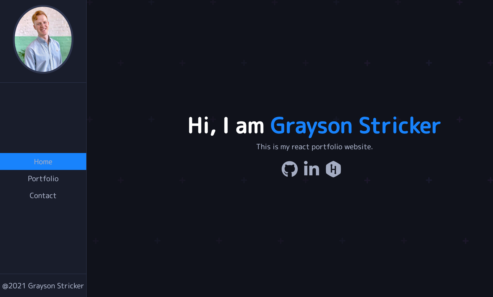

## Grayson Stricker React Portfolio
An updated portfolio page that is based off of [MaclLinz Youtube Tutorial](https://www.youtube.com/watch?v=ajgxZ5hBSHQ)

## Features

* About section with short bio.
* Skill list and Resume.
* Portfolio with deployed projects.
* Links to personal pages
  * HackerRank
  * GitHub
  * Linkedin

## Screenshots

## Technologies

<b>Project Created With</b>
- React
- SCSS
- HTML

## Link to deployed application 

[Grayson Stricker React Portfolio](https://g-strick.github.io/react-portfolio/)

## License

[MIT License](https://opensource.org/licenses/MIT)

